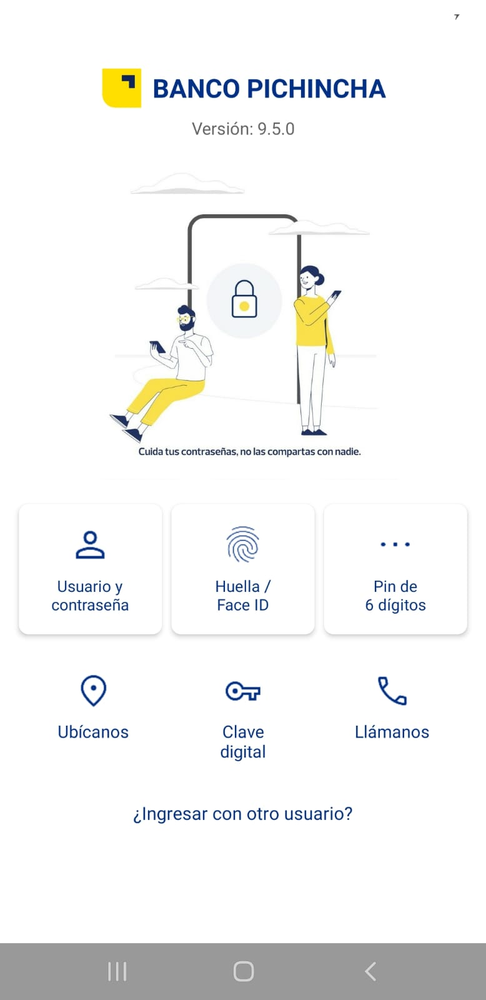

# App3 — Diseño Responsivo del Inicio de Sesión de una Aplicación Móvil


**Universidad:** Universidad Técnica Estatal de Quevedo (UTEQ)  
**Facultad:** Facultad de Ciencias de la Computación (FCC)  
**Carrera:** Software  
**Asignatura:** Aplicaciones Móviles "A"  
**Actividad:** Diseño Responsivo del Inicio de Sesión de una Aplicación Móvil  
**Estudiante:** Eduardo Reinoso Vélez  
© 2026

---

## Objetivo

Implementar una pantalla de inicio de sesión responsiva en Android nativo, replicando el diseño de la aplicación móvil del Banco Pichincha mediante `ConstraintLayout` y componentes de Material Design.

---

## Pantalla

| Pantalla | Descripción |
|---|---|
| **Login** | Logo del banco, ilustración central, métodos de acceso (Usuario/contraseña, Huella/Face ID, PIN 6 dígitos), accesos rápidos (Ubícanos, Clave digital, Llámanos) y enlace para ingresar con otro usuario |

---

## Tecnologías

| Tecnología | Versión | Rol |
|---|---|---|
| Android Studio | Panda 4 | IDE de desarrollo |
| Android (Java) | API 34+ | Plataforma de desarrollo nativa |
| ConstraintLayout | 2.2.1 | Layout responsivo por restricciones |
| Material Design | 1.13.0 | Componentes UI (CardView, botones) |
| Gradle | 9.2.1 | Gestión de dependencias |

---

## Responsividad

El diseño utiliza `ConstraintLayout` como sistema de posicionamiento flexible. Cada vista está anclada mediante constraints relativos (`layout_constraintTop_toBottomOf`, `layout_constraintStart_toEndOf`) en lugar de posiciones absolutas, lo que garantiza la adaptación a distintos tamaños y densidades de pantalla. El `ScrollView` raíz asegura que el contenido sea accesible en dispositivos con pantallas reducidas.

---

## Estructura del proyecto

```
App3/
├── app/
│   └── src/
│       └── main/
│           ├── java/com/uteq/software/app3/
│           │   └── MainActivity.java
│           ├── res/
│           │   ├── layout/
│           │   │   └── activity_main.xml
│           │   └── drawable/
│           │       ├── ic_logo_pichincha.xml
│           │       ├── background.jpg
│           │       ├── person.xml
│           │       ├── fingerprint.xml
│           │       ├── more_horiz.xml
│           │       ├── location_on.xml
│           │       ├── vpn_key.xml
│           │       └── phone.xml
│           └── AndroidManifest.xml
├── build.gradle
└── README.md
```

---

## Dependencias

```gradle
implementation "com.google.android.material:material:1.13.0"
implementation "androidx.constraintlayout:constraintlayout:2.2.1"
```

---

## Capturas



---

## Requisitos previos

- Android Studio Panda 4 o superior
- JDK 11
- Dispositivo o emulador con Android 8.0+ (API 26)

---

## Instalación y ejecución

1. Clonar el repositorio:

```bash
git clone https://github.com/ereinosov/App3.git
```

2. Abrir en Android Studio: **File → Open → seleccionar carpeta `App3`**
3. Sincronizar Gradle: **File → Sync Project with Gradle Files**
4. Ejecutar en dispositivo: **Run → Run 'app'**

---

## Repositorio

https://github.com/ereinosov/App3
